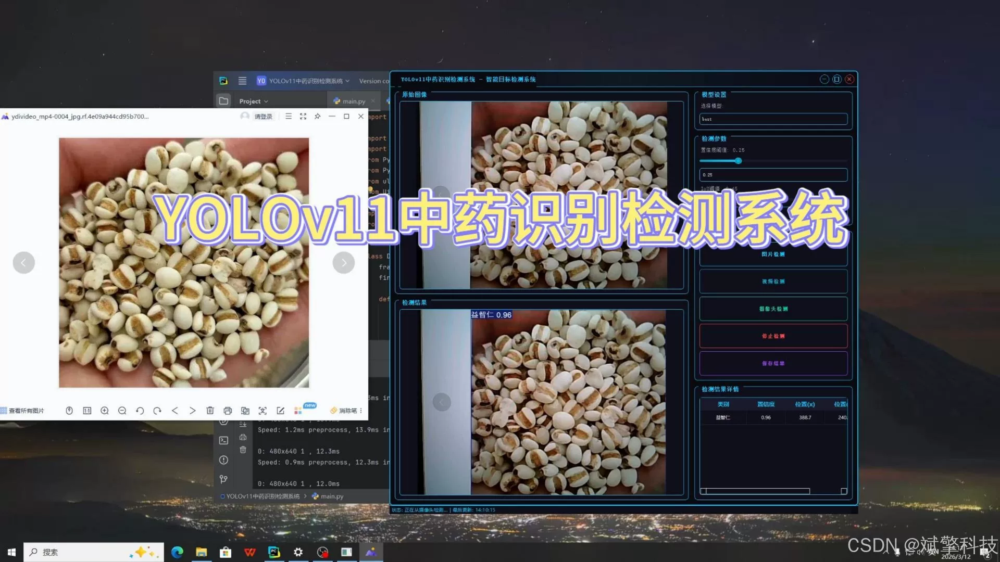
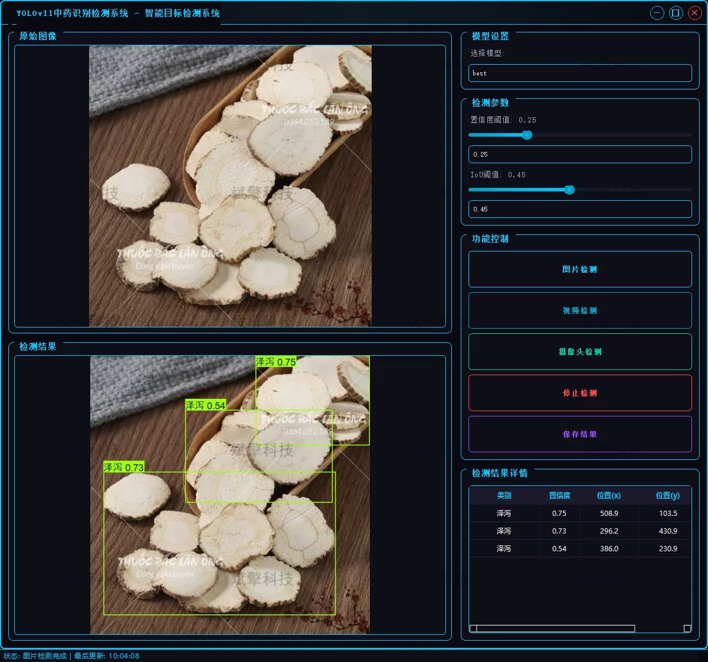
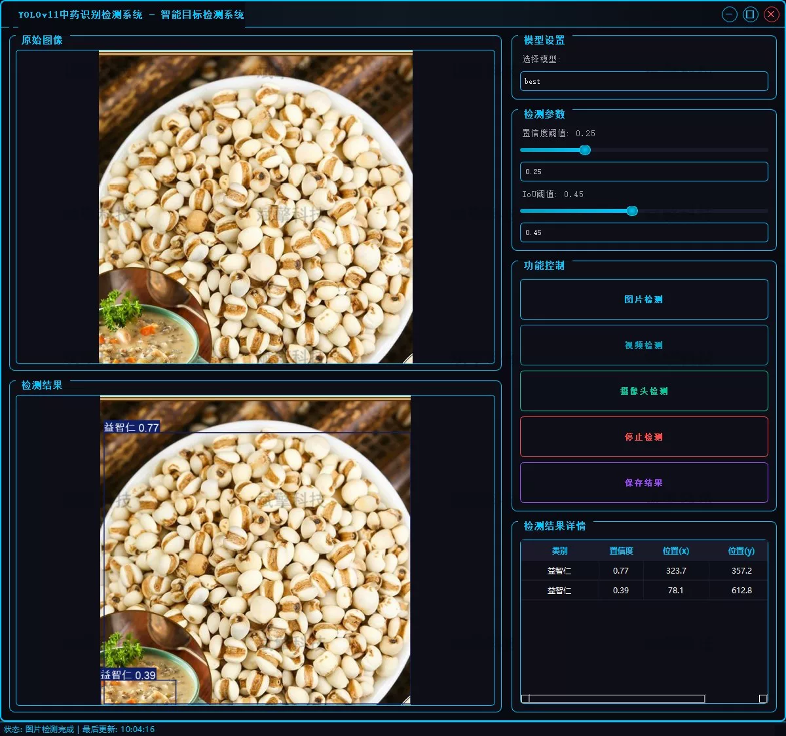
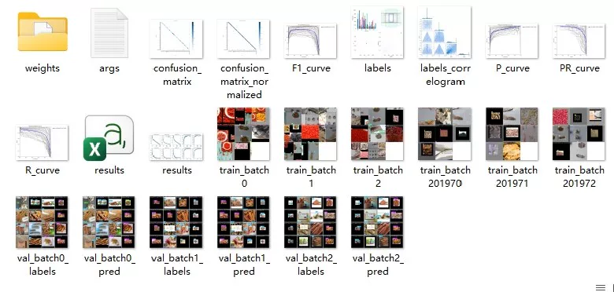
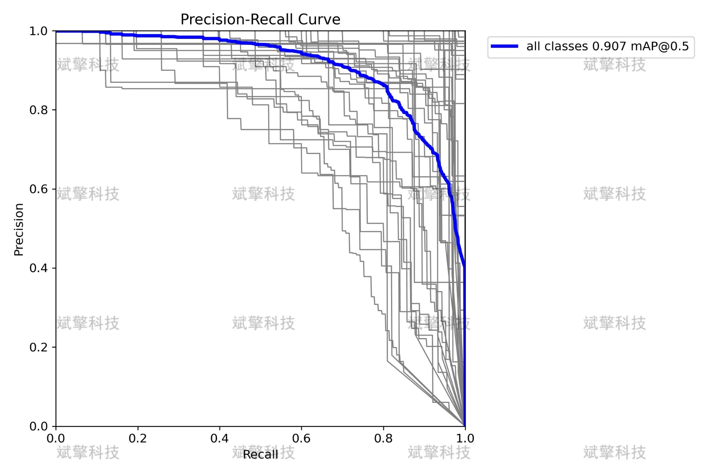
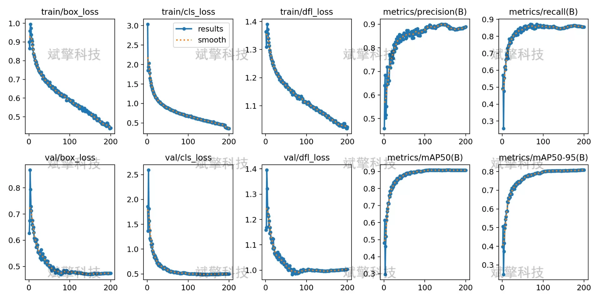
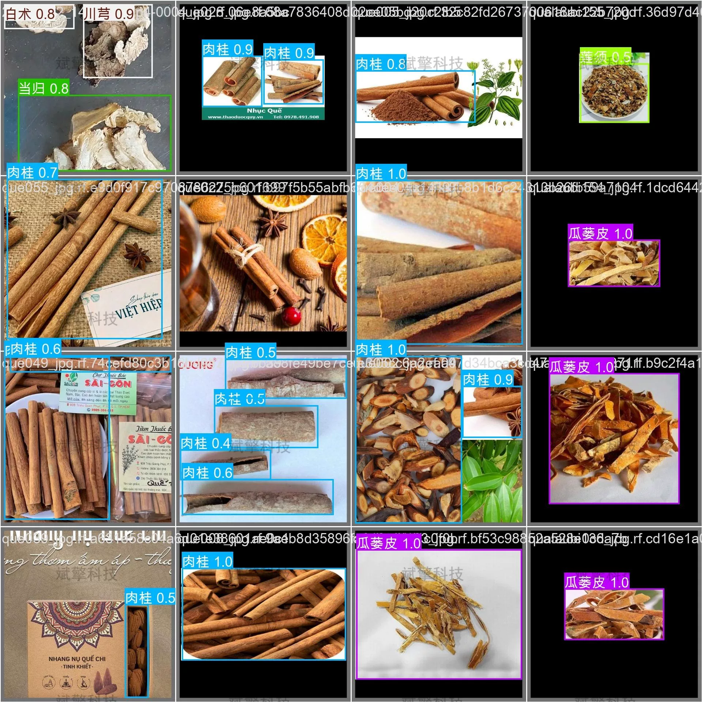

# YOLOv11 Traditional Chinese Medicine Identification System

## Body

YOLOv11 Traditional Chinese Medicine Identification System Based on YOLOv11 Deep Learning, including the YOLOv11+YOLO dataset, UI interface, login and registration interface, Python project source code, and model.

With the advancement of traditional Chinese medicine modernization, the automation detection and intelligent sorting of medicinal materials have become a key requirement for industry upgrading. Traditional manual identification methods are inefficient and subjective, difficult to meet the needs of large-scale production. This project has developed a visible light detection system targeting 45 common types of medicinal materials based on the cutting-edge YOLOv11 deep learning target detection algorithm. The system can efficiently and accurately identify various medicinal materials such as Bai Fuling, Bai Shao, Bai Zhu, Dong Ch夏草, Ren Shen, etc. The system supports three working modes: batch detection of static images, real-time analysis of dynamic video streams, and real-time capture of cameras, providing an efficient and precise AI solution for the automated grading of medicinal materials, screening of impurities, and warehouse management, aiming to reduce labor costs and enhance the standardization and intelligence level of traditional Chinese medicine production.

Project Functionality Exhibition

✅ User Login and Registration: Supports password verification and security validation.

✅ Three Detection Modes: Based on the YOLOv11 model, supports image, video, and real-time camera detection, with accurate recognition of targets.

✅ Dual-screen comparison: Displays the original scene and detection results on the same screen.

✅ Data Visualization: Real-time table displaying the category, confidence, and coordinates of detected targets.

✅ Intelligent Parameter Adjustment: Offers a confidence slide bar to dynamically optimize detection accuracy, adapting to different scene requirements.

✅ Sci-fi Interactive Interface: Dark theme combined with dynamic light effects, reducing visual fatigue and improving operational experience.

✅ Multi-thread High-performance Architecture: Independent detection threads ensure smooth operation, real-time status prompts, and rapid response without lag.

Dataset Introduction

The dataset is scientifically divided into a training set of 8500 images and a validation set of 1500 images.

## Images

## Payment

Here is a pay link on Stripe ( https://buy.stripe.com/3cs8yP7sY87d0vu9AB ). Please contact me lonlonago@foxmail.com after funding $89, and I will send you a complete data files , thank you!

